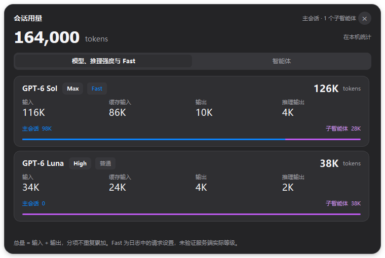
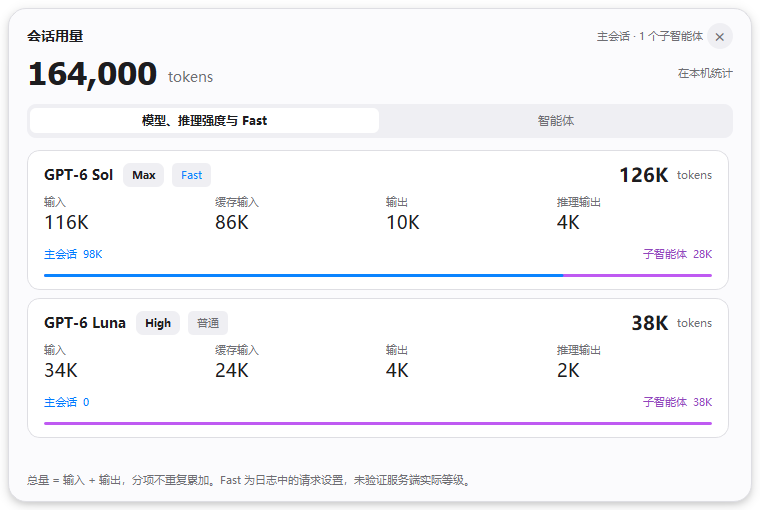

# Codex 会话模型用量

Windows 上的 Codex 会话用量插件与伴随悬浮条。只读本机日志，显示主会话和子智能体按模型、推理强度统计的 token 用量，统计过程不调用模型。



## 安装

1. 从 [Releases](https://github.com/CyclicRedundancyCHK/session-model-usage/releases) 下载 `session-model-usage-v0.1.2-windows-x64.zip`。
2. 完整解压，保留 `runtime` 及其 `_internal` 文件夹。无需安装 Python。
3. 双击 `安装插件.cmd`，再从 Windows 开始菜单打开 **Codex 会话用量**。
4. 如果 Codex 已通过普通方式启动，启动器会在托盘等待。保存工作并手动完全退出 Codex 后，它会自动用正确参数重新打开。

安装位置为 `%USERPROFILE%\plugins\session-model-usage`，通过 Codex CLI 注册本项目独立的插件市场，不修改其他插件的市场文件。已有用户双击安装脚本会自动升级：先备份、只停止本插件、保留原市场和快捷方式，注册失败时回滚。备份保留在个人插件目录的 `.session-model-usage-backups` 中。

首次安装后，插件技能在新的 Codex 会话中加载。也可直接打开 `runtime/CodexSessionUsage.exe` 启动伴随程序。

## 使用

用量条位于输入栏底部权限与背景信息控件之间。点击后查看模型、推理强度、输入、缓存输入、输出、推理输出，以及主会话和子智能体的贡献。

- 默认递归汇总主会话和所有子智能体，包括已结束的子智能体。
- 总量保留日志的 `total_tokens`；缓存输入和推理输出是分项，不重复相加。
- 同一模型的不同推理强度分别列出；未记录的归属明确展示，不用当前设置补填历史。
- 跟随会话、窗口位置、缩放与深浅主题。Codex 失去焦点后继续显示，其他应用遮挡它时也遮挡用量条；最小化、隐藏或无法确认会话时隐藏。
- Codex 升级或普通启动导致调试参数丢失时，再次打开专用启动器进入恢复等待，手动退出后自动恢复。



独立托盘管理进程在 Codex 关闭后保持待机，不自行重开。再次打开 Codex 后重新连接；悬浮条异常退出或心跳停止时自动恢复。一分钟内五次失败会暂停，并提供“恢复连接”。临时连接错误按 1、2、4、8、15 秒重试。

程序每 250 毫秒检查会话和位置，每秒增量刷新用量。只读取本机的会话索引和日志；调试连接验证为 Codex 自身在回环地址监听。没有开机自启。

## 命令

在解压目录的 PowerShell 中执行：

```powershell
.\runtime\session-usage.exe launch
.\runtime\session-usage.exe query --thread-id '<会话 UUID>'
.\runtime\session-usage.exe query --thread-id '<会话 UUID>' --no-descendants
.\runtime\session-usage.exe status
.\runtime\session-usage.exe diagnose
.\runtime\session-usage.exe --version
.\runtime\session-usage.exe stop
```

`query` 返回 JSON，默认使用 `CODEX_THREAD_ID` 或正在跟随的会话。`--codex-home <目录>` 可指定日志目录。`stop` 退出管理进程和悬浮条并取消恢复，Codex 继续运行。`status.running` 表示管理进程运行，待机时 `overlay_visible=false`；`healthy` 表示心跳新鲜；`supervisor_pid` 和 `worker_pid` 分别表示管理进程与实际悬浮条子进程。`overlay_pid` 兼容旧缓存，待机时可能指向管理进程。`diagnose` 只读取本地轮转诊断，不上传日志。

`complete` 表示现有记录可以完成统计，`partial` 表示存在证据缺口，`pending` 和 `totals: null` 表示尚无用量记录。`reasoning_effort: null` 表示没有记录，`none` 表示明确关闭推理。

## 开发与构建

源码在 `source`，支持 Windows x64、Python 3.13。

```powershell
python -m venv .venv
.\.venv\Scripts\python.exe -m pip install -r source/requirements.txt PyInstaller==6.22.3
$env:PYTHONPATH = 'source'
.\.venv\Scripts\python.exe -m unittest discover -s source/tests -v
.\.venv\Scripts\python.exe scripts/build_release.py
```

构建结果位于 `dist`，包含 Windows ZIP 安装包和 SHA-256 校验文件。脚本使用固定清单组装发布包，并检查敏感文件名、个人路径与非示例会话 UUID。仓库和发行包不包含本机日志、浏览器配置、认证文件、SQLite 索引或开发缓存。

## 兼容范围

已在 Codex Windows 安装包 `26.924.2738.0` 、`26.928.1915.0` 与 `26.930.2377.0` 验证会话识别与输入栏位置，并验证新版恢复流程。使用了内部界面标识和只读路由，后续 Codex 更新可能需要适配。

首版支持本机 Codex 会话。云端、ChatGPT Work 和远程主机会话暂不支持。跨物理屏幕的混合 DPI、两个真实会话窗口同时运行仍待完整实机验收，详见 [验证说明](docs/verification.md)。

这是社区项目，不是 OpenAI 官方产品。本项目源码采用 MIT 许可证；发行包的第三方组件遵循各自许可证，见 [第三方说明](THIRD_PARTY_NOTICES.md) 和 `licenses`。
