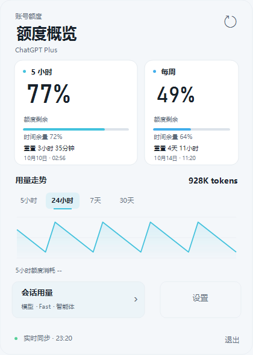
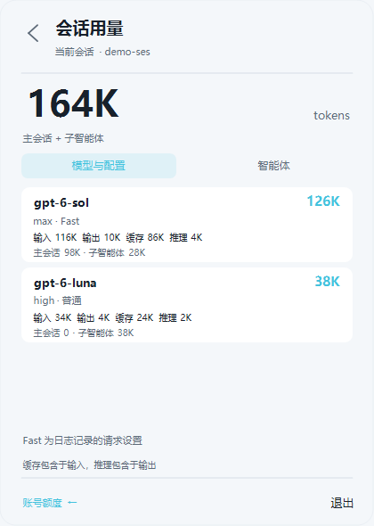

# Codex 用量助手

Windows 上统一的 Codex 会话统计与账号额度工具。结合 [CodexQuotaTray](https://github.com/SYD-Official/CodexQuotaTray) 的额度能力和本项目的会话、子智能体统计，用本项目独立设计的任务栏额度条和托盘概览，一个启动器与一个托盘入口同时提供两类功能。

当前正式版本为 **0.2.2**，新增多模型 Fast 提交等级留存、完成会话移出最近列表后的提示清理，以及额度查询连接隔离。右键菜单与最近会话菜单共用圆角主题样式，任务状态按 Err、Ask、Finish、Working 的优先级跨会话汇总。任务栏余额下方直接显示重置倒计时，保持原有尺寸；“显示 5 小时余额”开关同步控制 5 小时倒计时。最近会话菜单与输入栏 token 明细均支持再次点击入口或点击外部空白区域收起；任务栏悬停详情使用统一的圆角主题卡片。最近会话名称与 Codex 一致，最多 12 个字符，超出用省略号，不显示会话 ID。保留最近 6 个会话跳转、Micro 连续鼠标切换修复、Working / Ask / Finish / Err 状态提示和用量统计。完整 Windows 安装包及 SHA-256 校验文件见 [GitHub Release](https://github.com/CyclicRedundancyCHK/session-model-usage/releases/tag/v0.2.2)，也可从源码构建。


## 安装

1. 从 [GitHub Release](https://github.com/CyclicRedundancyCHK/session-model-usage/releases/tag/v0.2.2) 下载 `session-model-usage-v0.2.2-windows-x64.zip`。
2. 完整解压，保留 `runtime` 及其 `_internal` 文件夹。无需安装 Python。
3. 双击 `安装插件.cmd`，再从 Windows 开始菜单打开 **Codex 会话用量**。
4. 工具与 Codex 可以按任意顺序打开。通过官方图标启动 Codex 后，托盘工具会自动连接；关闭 Codex 后工具继续待机，重开后恢复。无需退出当前会话或更换官方图标。

安装位置为 `%USERPROFILE%\plugins\session-model-usage`，通过 Codex CLI 注册本项目独立的插件市场，不修改其他插件的市场文件。已有用户双击安装脚本会自动升级：先备份、只停止本插件、保留原市场和快捷方式，注册失败时回滚。备份保留在个人插件目录的 `.session-model-usage-backups` 中。

首次安装后，插件技能在新的 Codex 会话中加载。也可直接打开 `runtime/CodexSessionUsage.exe` 启动伴随程序。

## 使用

点击任务栏数字条或托盘，查看账号的 5 小时与每周额度、备用额度、重置倒计时和使用节奏。详情页的“会话用量”及托盘菜单显示当前本地会话的模型、推理强度、Fast、输入/输出/缓存/推理分项和子智能体明细。输入栏旁原有悬浮条与完整模型卡片保留。

最近会话菜单打开后，再次点击中间的 Codex 状态区域或点击菜单外部会收起。输入栏 token 明细同样支持再次点击 token 按钮或点击明细外部收起；点击模型/智能体页签、卡片或滚动区域继续操作。弹窗不抢占 Codex 焦点，不吞掉外部点击；关闭后不会被同一次点击重新展开。任务栏悬停卡片沿用当前深浅主题、配色、字体/面板缩放和玻璃偏好，移开鼠标或打开其他详情时收起。

任务栏使用带 `5h`、`周`（英文 `W`）标记的双额度条，备用额度标为 `R`。各自余额下方使用小号次要文字显示重置倒计时，如 `3h26m` 或 `4d12h`（d 为天、h 为小时、m 为分钟），不扩大数字条；剩余不足一分钟显示 `1m`，到期后显示“待刷新”，缺失时间显示 `--`。可见时每 15 秒刷新本地倒计时，悬停仍可查看详情。托盘概览并排展示周期额度卡片、时间余量、重置时间，下面提供活动走势与会话/设置入口。主额度强调及并重布局均可在设置中选择，玻璃与深浅主题继续沿用现有偏好。

在“设置”中切换“显示 5 小时余额”，关闭后任务栏和额度页只显示每周或备用余额及对应倒计时，托盘提示同步更新；开关自动保存，默认开启。5 小时 token 图表仍可查看。原“短周期额度强调”移动至“更多设置”，恢复默认会重新开启 5 小时余额显示。

设置页的“Codex 状态提示”默认开启并自动保存。任务栏用量条中间显示完成 Finish（绿）、等待用户回答或确认 Ask（橙）、明确终止故障 Err（红）或运行 Working（蓝色呼吸）。遵循 Windows 动画关闭偏好；隐藏数字条后停止动画。所有已确认会话的状态按 P0 Err、P1 Ask、P2 Finish、P4 Working 汇总；最新或当前会话的运行状态不会覆盖其他会话的更高优先级提示，悬停查看各状态数量。点击余额或托盘只清除独立闪烁提醒，Err/Finish 在打开对应会话后逐项确认；Ask 在用户回答或任务完成、取消、失败后清除，不凭历史异步调用持续显示。同会话的新任务替换自身旧终止提示，不清除其他会话提示。无确认状态时显示中性的 Codex。

右键数字条或托盘打开统一的圆角主题菜单，保留账号额度、当前会话用量、恢复会话连接、立即刷新与退出入口；跟随深浅主题、配色、玻璃及缩放设置。选择操作或点击外部区域后收起，菜单不抢占 Codex 焦点。

完成会话移出已确认且新鲜的最近六个列表后，Finish 提示自动清除。列表过期、损坏或比完成事件旧时等待下一次刷新；Err、Ask、Working 继续按各自生命周期处理。

状态来自已确认的本地 Codex 会话生命周期及当前桌面进程日志，每两秒在后台增量检查。启动时恢复运行/等待状态，但不提醒历史完成；内部临时生成请求、单个命令失败、界面错误和明确的自动重试不当作任务故障。确认会话文件身份后才处理桌面事件；日志采用有限尾部读取，半行写入等待补齐。关闭 Codex 时清空状态，记录不可读时不会伪造 Err。不根据消息正文判断状态，也不保存正文。

点击中间的 **Codex 状态区域**，向上弹出最近 6 个未归档主会话菜单；按本地侧边栏的最近活动顺序排列，不包含子智能体和内部审核任务。标签显示 Working / Ask / Finish / Err 时也打开同一个最近会话菜单，各条目用小圆点提示已确认的任务状态。名称优先使用 Codex 的显示名称，旧版索引没有名称字段时回退到标题；最多显示 12 个字符，超出时用第 12 位的省略号表示，悬停查看完整名称。名称缺失显示“未命名会话”，列表及悬停提示均不显示会话 ID；准确 ID 仅在内部用于点击跳转。菜单沿用工具的深浅主题、配色、圆角、玻璃偏好及字体/面板缩放。索引不可读取时显示等待提示，少于 6 个时显示实际数量；余额区域继续打开额度页。打开 Ask 不回答提问，打开 Finish / Err 只确认所选且未更新的提示。

四套主题为黑白、冰川蓝、玫瑰粉和香槟金，与自定义主辅色同步改变额度页、设置页、任务栏和输入栏会话详情的背景、卡片、轨道、按钮与边框。黑白使用中性灰阶，浅色外观切换为黑色强调；原四套配色的已保存选择按位置对应新主题。设置页提供随深浅外观变化的小型主题预览和选中标记，浅色文字强调色调整对比度，状态提示保留固定含义的颜色。玻璃开关与透明度继续沿用原偏好。

会话明细面板与磨砂背景使用一致的圆角，缩放时同步更新。系统圆角接口不可用时保留透明材质，不启用会溢出四角的矩形磨砂；关闭玻璃时仍显示完整圆角。

额度概览的外框与系统磨砂使用一致的圆角，放大内容时不会在边角留下第二层轮廓。系统圆角接口不可用时，额度概览使用与描边一致的圆角实色底板，避免矩形磨砂残边。

5 小时、24 小时图表均按所选时段内已记录的账号周额度变化显示消耗；有 5 小时额度时，5 小时页同时显示短周期消耗，24 小时页只显示周额度消耗。悬停明细使用相同的周期归属。额度池分别统计，不混入备用余额；历史不足显示 `--`，不根据 token 推算额度。时段起点没有近期基线时从首个时段内快照开始统计，不把更早的消耗补入该时段。

更多设置中的“项目与更新”展示整合项目维护者和完整版本号，“项目仓库”与“问题反馈”指向本仓库。上游组件来源、原作者版权及 MIT 许可保留在 `THIRD_PARTY_NOTICES.md`、`source/quota_tray/UPSTREAM.md` 与 `licenses/CodexQuotaTray-MIT.txt`。

额度每 20 秒通过已安装的 `codex app-server` 只读获取，查询子进程显式禁用 `daemon_auto_start`，保持独立于桌面共享 daemon。查询只初始化并读取额度，不回答问题或审批；同编号的服务端请求也不会被当作额度响应。独立账号准备的等待上限为 10 秒，失败或 CLI 不支持隔离特性时显示本地缓存及其更新时间。额度百分比代表账号额度；本地 token 代表现存本机请求记录，两者不能互相换算。未提供的周期额度显示 `--`。活动图表支持当前 5 小时额度周期、24 小时、7 天、30 天；无有效 5 小时额度周期时统计近 5 小时的本地活动，使用同一请求去重引擎。明确缺口没有请求时间时不猜测所属时间桶，图表显示部分记录。删除过的日志、其他电脑及未确认历史不包含在内。

设置提供任务栏数字条、两种额度布局、配色、深浅/系统主题、中文/英文、尺寸与玻璃透明度。任务完成闪烁提醒默认关闭，可在更多设置启用。整合版只在手动点击“检查更新”时连接本项目 GitHub 发布接口，发现完整整合包后打开发布页下载，沿用有备份和回滚的安装流程；不会下载上游单模块 EXE 替换整个工具。

输入栏旁展开的会话明细也使用透明玻璃背景，模型和智能体卡片保持半透明。它与托盘共用“柔光玻璃”开关和不透明度，设置变化会自动同步到已展开的明细；文字和数字不会随背景一起变淡。

设置、额度历史和元数据桥接位于 `%LOCALAPPDATA%\CodexSessionUsage`，原有 `%LOCALAPPDATA%\CodexMeter` 设置及额度历史首次使用时复制，旧文件保留。只有用量及窗口状态写入本地桥接，不含对话正文。账号身份由 Codex 自身处理，程序不读取认证文件或显示账号标识；套餐字段由额度接口提供，缺失时隐藏。





用量条位于输入栏底部权限与背景信息控件之间。点击后查看模型、推理强度、输入、缓存输入、输出、推理输出，以及主会话和子智能体的贡献。

- 默认递归汇总主会话和所有子智能体，包括已结束的子智能体。
- 同一会话的分页日志按 `history_base` 指定的字节和记录边界恢复历史请求及模型明细；派生会话不重复统计父会话的历史。前缀缺失、边界无效或来源冲突时保留 `partial`。
- 请求明细缺失但累计证据可以核对时，将缺口计入总量并列为未归属。迟到明细替代缺口，重复查询不重复计数。
- 总量保留日志的 `total_tokens`；缓存输入和推理输出是分项，不重复相加。
- 同一模型的不同推理强度和 Fast 请求设置分别列出；迟到的同轮元数据会补齐已记录用量，不用当前设置补填历史。
- 跟随会话、窗口位置、缩放与深浅主题。Codex 失去焦点后继续显示，其他应用遮挡它时也遮挡用量条；最小化、隐藏或无法确认会话时隐藏。
- Micro 创建的本地草稿会先显示等待用量记录的统计条，临时客户端 ID 不用于查询 token；正式会话路由或 Codex 唯一明确的客户端映射到达后自动统计。映射冲突时等待；切换草稿会清除旧会话明细，迟到的旧用量不会填入新草稿。
- 窄输入栏使用紧凑数字或 `Σ` 标记，悬停与明细仍显示完整 token 含义；没有安全空位时继续隐藏，不覆盖原输入栏控件。
- 默认独立启动托盘工具，不自动打开 Codex；官方图标、开始菜单、任务栏原入口均保留。


独立托盘管理进程在 Codex 关闭后保持待机，不自行重开。官方启动没有调试端口时，直接读取当前 Codex 进程日志中的明确窗口路由，再通过 Windows UI Automation 定位输入栏。先开工具、先开 Codex、关闭后重新打开均自动连接。托盘“恢复连接”只重试连接，不安排重启 Codex。

悬浮条异常退出或心跳停止时自动恢复。一分钟内五次失败会暂停，并提供“恢复连接”。临时连接错误按 1、2、4、8、15 秒重试。

程序每 250 毫秒检查会话和位置，每秒增量刷新用量。只读取本机的会话索引、窗口路由日志和辅助功能控件，不读取输入文本或操作剪贴板；已有调试连接仍验证为 Codex 自身在回环地址监听。没有开机自启。

## 命令

在解压目录的 PowerShell 中执行：

```powershell
.\runtime\session-usage.exe launch
.\runtime\session-usage.exe query --thread-id '<会话 UUID>'
.\runtime\session-usage.exe query --thread-id '<会话 UUID>' --no-descendants
.\runtime\session-usage.exe status
.\runtime\session-usage.exe diagnose
.\runtime\session-usage.exe --version
.\runtime\session-usage.exe stop
```

`query` 返回 JSON，默认使用 `CODEX_THREAD_ID` 或正在跟随的会话。`--codex-home <目录>` 可指定日志目录。`stop` 退出管理进程和悬浮条并取消恢复，Codex 继续运行。`status.running` 表示管理进程运行，待机时 `overlay_visible=false`；`connection_mode` 为 `windows_accessibility` 或 `cdp`；`healthy` 表示心跳新鲜；`supervisor_pid` 和 `worker_pid` 分别表示管理进程与实际悬浮条子进程。`overlay_pid` 兼容旧缓存，待机时可能指向管理进程。`diagnose` 只读取本地轮转诊断，不上传日志。

`complete` 表示现有记录可以完成统计，`partial` 表示存在证据缺口，`pending` 和 `totals: null` 表示尚无用量记录。`reasoning_effort: null` 表示没有记录，`none` 表示明确关闭推理。

`models[].reasoning_efforts` 保留原有按强度汇总。新增 `models[].configurations`，按推理强度与服务等级联合分组，含 `service_tier`、`fast_mode`、`totals`、`main`、`subagents` 和记录数量。`priority/fast` 对应 Fast，`default/standard` 对应普通；缺失或其他等级对应 `fast_mode: null`，其他等级保留原值。Fast 是日志中的请求设置，不代表服务端实际采用的等级。

新版 Codex 的 JSONL 可能省略每轮提交的服务等级。统计器会只读同一 Codex 目录的 `logs_2.sqlite`，按准确的会话 ID、轮次 ID 和请求时间补齐缺失字段；已明确记录的等级不被替换。只解析结构化提交中的服务等级，正文字符串不参与判断，也不保存到统计结果或桥接文件。每个会话最多读取 256 条提交日志、每条最多 262144 字符、累计最多 2 MiB 字节；日志缺失、冲突、超限或不可读取时保留未记录，不根据当前 Fast 开关猜测历史。

插件运行时，每两秒增量留存所有模型及会话的明确提交等级，包含 Astra max 和子智能体，避免未打开的会话在后台日志清理后失去 Fast 归属。缓存位于 Codex 目录的 `cache/session-model-usage/request-tiers.json`，只含会话 ID、轮次 ID、等级及时间，最多 8192 条、读取上限 2 MiB。查询只读此缓存，不额外记录或调用模型；已经清理且没有留存配置证据的旧请求仍显示未记录。

较新的 SQLite 索引损坏、迁移未完成或结构变化时，查询尝试仍可读取的旧索引和日志头中的明确父子关系。日志归档移动也会重新定位。回退结果保留不完整标记，不把缺失记录显示为零。

## 开发与构建

源码在 `source`，支持 Windows x64、Python 3.13。原生额度组件在 `source/quota_tray`，构建使用 Windows 自带 .NET Framework 4.8 C# 编译器，不需要 Visual Studio 或额外 .NET SDK。

```powershell
python -m venv .venv
.\.venv\Scripts\python.exe -m pip install -r source/requirements.txt PyInstaller==6.22.3
$env:PYTHONPATH = 'source'
.\.venv\Scripts\python.exe -m unittest discover -s source/tests -v
.\.venv\Scripts\python.exe scripts/build_release.py
```

构建结果位于 `dist`，包含 Windows ZIP 安装包和 SHA-256 校验文件。脚本使用固定清单组装发布包，并检查敏感文件名、个人路径与非示例会话 UUID。仓库和发行包不包含本机日志、浏览器配置、认证文件、SQLite 索引或开发缓存。

## 兼容范围

已在 Codex Windows 安装包 `26.924.2738.0` 、`26.928.1915.0` 与 `26.930.2377.0` 验证会话识别与输入栏位置，并验证新版恢复流程。`26.930.3748.0` 另支持无调试端口的官方启动方式。`26.1002.7124.0` 验证了新版辅助功能客户端、输入栏布局和分页历史读取。具体实机验证边界见 [验证说明](docs/verification.md)。

统计不使用模型或 Codex 版本白名单。原生定位按明确路由、辅助功能角色及实际控件边界识别；上下文环缺失时使用权限组与右侧按钮之间的实际空位。辅助功能事务超时缩短至 1.5 秒，避免默认 20 秒调用超过 15 秒心跳期限；旧系统不支持超时能力时写入诊断。

`status.compatibility` 和 `diagnose.state.compatibility` 提供 `codex_version`、`reason`、路由同步与可见窗口数量。`reason` 包括 `supported`、`route_logs_missing`、`route_sync_pending`、`composer_layout_unavailable`、`accessibility_retry`、`ambiguous_windows`、`local_route_unavailable` 和 `navigation_pending`，便于区分版本变化影响了哪个能力。首页或非本地会话也会返回 `local_route_unavailable`。内部路由或辅助功能协议仍可能变化，未知结构会隐藏旧用量并说明原因，未来版本需要实机验证。

支持本机 Codex 会话及本地草稿。云端、ChatGPT Work 和远程主机会话暂不支持。原生连接保留已确认的 HWND、辅助功能文档与日志窗口身份；新窗口可通过明确初始路由或剩余唯一配对建立绑定。多个同类型窗口仍无法唯一对应时隐藏，不按标题匹配。跨物理屏幕混合 DPI 与多窗口的完整实机验收范围见 [验证说明](docs/verification.md)。

这是社区项目，不是 OpenAI 官方产品。本项目源码采用 MIT 许可证；发行包的第三方组件遵循各自许可证，见 [第三方说明](THIRD_PARTY_NOTICES.md) 和 `licenses`。
